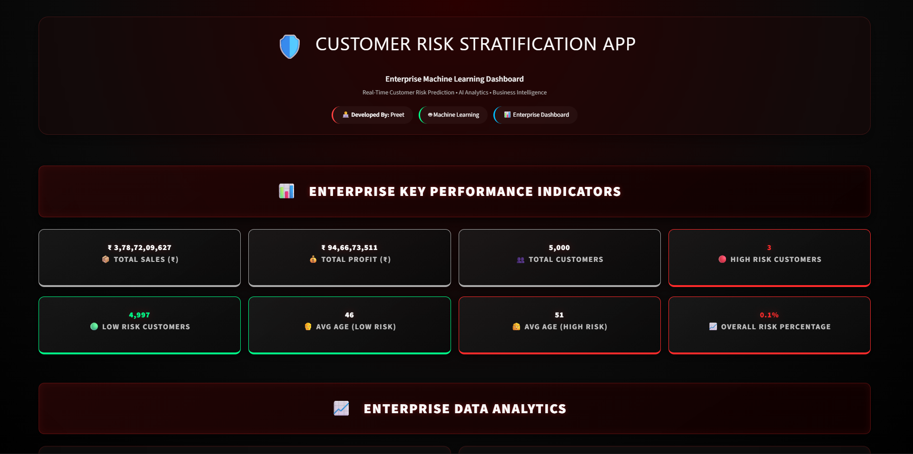
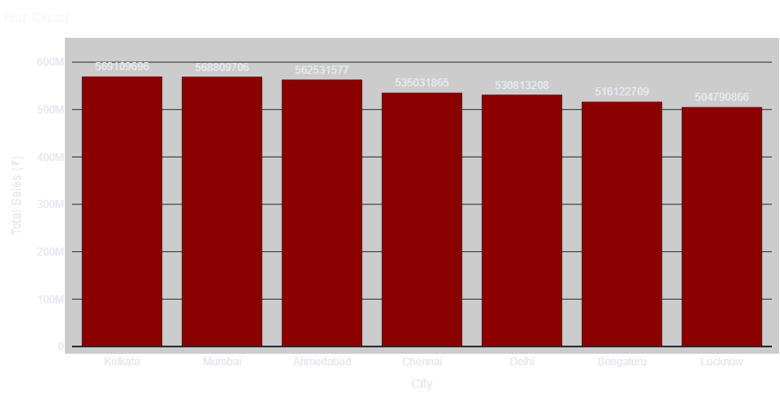
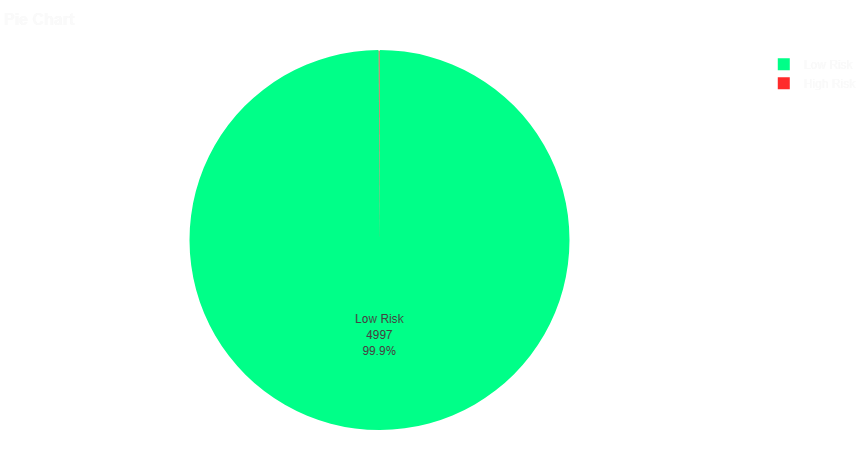
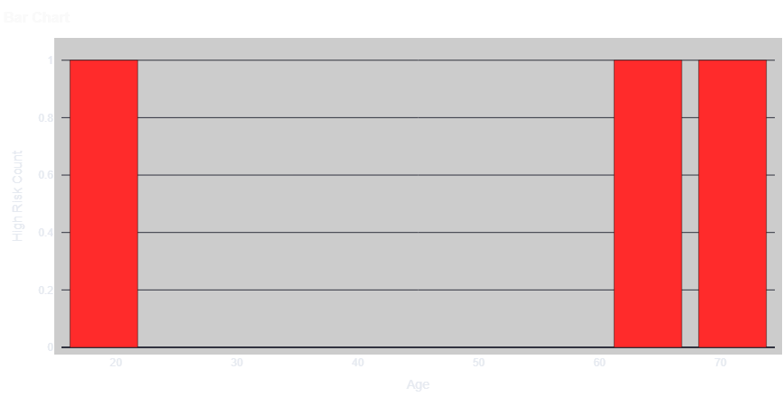
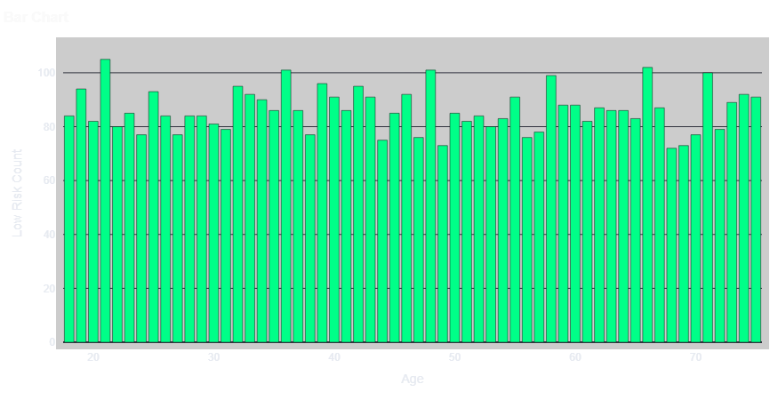

# 🛡️ Customer Risk Stratification App

## 📌 Project Overview

Customer Risk Stratification App is a Machine Learning web application developed using **Python** and **Streamlit**. The application predicts customer risk levels by analyzing customer and order data and provides interactive dashboards with business insights.

The project uses over **300,000+ customer and order records** to perform data preprocessing, risk prediction, and visualization.

---

# 🚀 Features

- Customer Risk Prediction
- Machine Learning Model Integration
- Interactive Streamlit Dashboard
- Customer Analytics
- Sales Analysis
- Order Analysis
- Region-wise Analysis
- Category-wise Analysis
- Business Insights
- Interactive Charts
- Real-time Predictions

---

# 📂 Dataset

| Dataset | Records |
|----------|----------|
| Customers | 300,000+ |
| Orders | 300,000+ |

---

# 🤖 Machine Learning

The project includes a trained machine learning model for customer risk prediction.

Model Used:

- Customer Risk Classification Model

Model File:

```
customer_risk_model.pkl
```

---

# 🛠 Technologies Used

- Python
- Streamlit
- Pandas
- NumPy
- Scikit-learn
- Plotly
- Joblib

---

# 📊 Dashboard Features

- Customer Risk Distribution
- High Risk Customers
- Medium Risk Customers
- Low Risk Customers
- Sales Overview
- Revenue Analysis
- Interactive Charts
- Customer Statistics

---

# 💡 Skills Demonstrated

- Machine Learning
- Classification
- Data Cleaning
- Feature Engineering
- Data Analysis
- Model Deployment
- Streamlit Development
- Business Intelligence
- Data Visualization

---

# 📁 Project Structure

```
Customer-Risk-Stratification-App/
│
├── app.py
├── customer_risk_model.pkl
├── Customers.csv
├── Orders.csv
├── Risk_Model.ipynb
├── README.md
└── screenshots/
```

---

# 📷 Project Preview

## 🏠 Dashboard Home



---

## 📊 Sales by Region



---

## 🥧 Risk Distribution



---

## 🔴 High Risk Customers with Age



---

## 🟢 Low Risk Customers with Age



# 👨‍💻 Author

**Preet**
